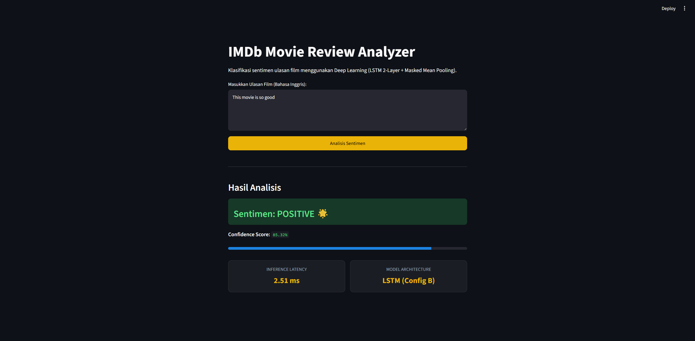
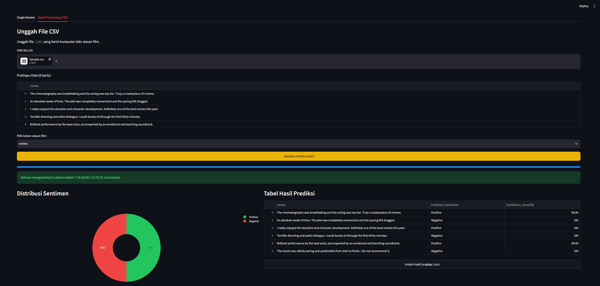

# IMDb Movie Review Sentiment Analyzer

Aplikasi klasifikasi sentimen ulasan film (Positive vs Negative) berbasis PyTorch dan Streamlit. Model dilatih menggunakan arsitektur Deep Learning **LSTM (Config B: 2-Layer Recurrent)** dengan pendekatan **Masked Mean Pooling** pada dataset IMDb.

---

## Riwayat Versi Aplikasi (Changelog & Versioning)

Dokumentasi iterasi rilis fitur aplikasi sesuai prinsip MLOps:

| Versi | Fitur yang Diimplementasikan | Detail Teknis & UI | Dokumentasi Tampilan |
| :---: | :--- | :--- | :---: |
| **v1.0** | • Inferensi teks tunggal (Single Review).<br>• Input `st.text_area` standar.<br>• Output prediksi sentimen & confidence bar. | Model LSTM 2-Layer + Masked Mean Pooling, benchmark inference latency (ms), dan caching model. |  |
| **v2.0** | • Batch processing CSV upload.<br>• Donut Chart visualisasi distribusi kelas.<br>• Ekspor/unduh laporan hasil prediksi (.csv). | Integrasi Plotly Express, progress bar inferensi massal, dan latency per review. |  |


---

## Instalasi & Menjalankan Lokal

1. **Clone repositori:**
   ```bash
   git clone https://github.com/BayuAlif/IMDb_sentiment_analyzer_MBC
   cd imdb-sentiment-app
